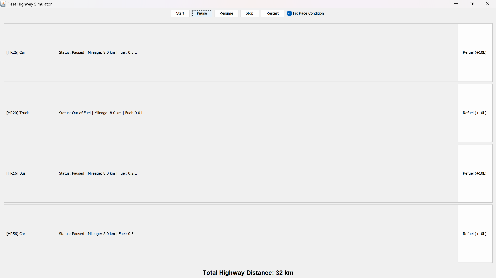

# Transportation Fleet & Highway Simulator

A comprehensive Java system demonstrating two core Computer Science competencies: __Object-Oriented System Design__ and __Operating System Concurrency__. This project is divided into two distinct modules sharing a common codebase.

---

##  Module 1: Fleet Management System (OOP)
__Focus:__ Backend Architecture, Design Patterns, and Data Structures.

This module simulates a logistics company managing a dynamic fleet of __Cars, Trucks, Buses, Airplanes, and Cargo Ships__. It handles complex operations like cargo loading, passenger boarding, and fuel estimation.

### Key Technical Concepts
- __Polymorphism:__ Unified `move()` and `calculateFuelEfficiency()` methods that behave differently for each vehicle type.
- __Interfaces:__ Modular behaviors implemented via `FuelConsumable`, `CargoCarrier`, `PassengerCarrier`, and `Maintainable`.
- __Collections Framework:__
  - `HashSet`: Ensures unique Vehicle IDs.
  - `TreeSet`: Maintains a sorted list of distinct vehicle models.
  - `ArrayList`: Manages dynamic fleet storage.
- __Persistence:__ Full Save/Load functionality using CSV file I/O.

### Features
- __Dynamic Fleet Control:__ Add/Remove vehicles with duplicate ID validation.
- __Advanced Reporting:__ Generate fleet-wide statistics (Average Efficiency, Counts by Type) and find the Fastest/Slowest vehicles.
- __Sorting:__ Sort fleet by Efficiency, Model Name (A-Z), or Max Speed.

---

##  Module 2: Highway Simulator (Concurrency)
__Focus:__ Multithreading, Thread Safety, and UI/UX.

This module is a __GUI-based simulation__ of a fleet traveling on a highway. It explicitly demonstrates a __Race Condition__ and how to solve it using Synchronization.

### The Race Condition Demo
- __The Problem:__ The `Highway` class has a shared static counter (`highwayDistance`). When "Fix Race Condition" is __unchecked__, multiple vehicle threads read-modify-write this variable simultaneously without locks.
  - _Result:_ Updates are lost, and the "Total Distance" lags behind the actual sum of vehicle mileages.
- __The Solution:__ When "Fix Race Condition" is __checked__, the system switches to a `synchronized` method, creating a monitor lock on the class.
  - _Result:_ Threads wait their turn, ensuring data integrity.

### GUI & Threading Architecture
- __Swing GUI:__ Built with `JFrame` and custom panels for real-time visualization.
- __Thread Safety:__ Uses `SwingUtilities.invokeLater()` to safely update UI components (`JLabel`) from background threads, preventing graphical glitches.
- __Volatile Flags:__ Uses `volatile` booleans (`running`, `paused`) to control thread lifecycles safely.

### Screenshots
| Race Condition (Data Loss)              | Synchronized (Correct Data) |
|:---------------------------------------:|:---------------------------:|
|  |  |

---

##  Project Structure
The codebase is organized into modular packages:
- `Vehicles/`: Abstract base classes and concrete implementations (Car, Truck, etc.).
- `Interfaces/`: Capability contracts (`FuelConsumable`, etc.).
- `Management/`: Logic for the Fleet Manager and Comparators.
- `simulation/`: GUI and Multithreading logic (`VehicleTask`, `Highway`).
- `ui/`: CLI entry point.
- `Exceptions/`: Custom error handling (`OverloadException`, `InsufficientFuelException`).

---

##  How to Run

### Prerequisites
- Java JDK 8 or higher.

### 1. Compile the Project
Open a terminal in the `src` folder and run:
```bash
javac -d ../bin ui/Main.java simulation/FleetSimulatorGUI.java Vehicles/*.java Management/*.java Interfaces/*.java Exceptions/*.java Management/Comparators/*.java

2. Run Module 1 (Fleet Manager CLI)
Access the 24-option menu for fleet management:
java -cp ../bin ui.Main

3. Run Module 2 (Highway Simulator GUI)
Launch the graphical simulation:
java -cp ../bin simulation.FleetSimulatorGUI
